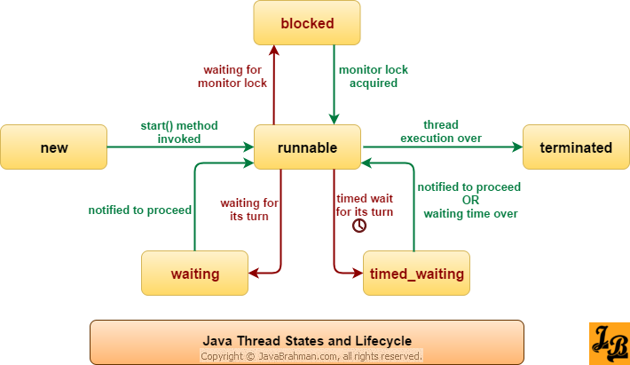
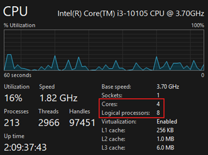

# 🧵 Threads: Hilos y Concurrencia

Los temas fueron tomados del curso de
[Máster Completo en Java de cero a experto 2025 (+178 hrs)](https://www.udemy.com/course/master-completo-java-de-cero-a-experto/learn/lecture/22747925#overview)
de Andrés Guzmán (Sección 25).

---

## 📘 ¿Qué son los hilos?

Un `hilo` (o `thread`) es la unidad más pequeña de ejecución dentro de un programa. Cada hilo tiene su propio flujo de
control, lo que permite que un `programa realice múltiples tareas de manera concurrente`.

> En términos simples: mientras un hilo realiza una tarea (por ejemplo, leer un archivo), otro puede ejecutar una
> tarea diferente (por ejemplo, procesar datos o atender una petición HTTP).

### ⚙️ Beneficios de usar hilos

- Mejor aprovechamiento del CPU en sistemas multinúcleo.
- Permite mantener aplicaciones responsivas (por ejemplo, evitar que la UI o el servidor se bloqueen).
- Facilita la ejecución concurrente de tareas independientes.

### ⚠️ Desventajas o retos

- Manejo de sincronización (evitar `race conditions` o inconsistencias de datos).
- Dificultad para depurar o reproducir errores.
- El uso excesivo de hilos puede saturar la memoria o el planificador del sistema operativo.

### 🔍 Características

- ` Entorno multihilo (multi-thread)`: la JVM es un entorno que soporta la ejecución de múltiples hilos dentro del mismo
  proceso, lo que permite que varias tareas avancen de forma concurrente.
- `Soporte de lenguaje`: Java ofrece soporte de hilos mediante la clase Thread y la interfaz Runnable. Además, la clase
  Object proporciona métodos básicos de coordinación (wait(), notify(), notifyAll()).
- `Gestión y planificación`: en la práctica la JVM colabora con el sistema operativo para la planificación de hilos
  (modelo 1:1 en la mayoría de implementaciones). La JVM y el SO gestionan cuándo y en qué orden se ejecutan los hilos,
  así como prioridades y cambios de contexto.
- `Concurrencia vs paralelismo`: la ejecución concurrente permite que diferentes partes del programa progresen
  simultáneamente en el sentido lógico; el paralelismo (ejecución real al mismo tiempo) depende de disponer de múltiples
  núcleos de CPU.
- `Compartición de recursos`: los hilos de un mismo proceso comparten el heap y recursos del proceso (objetos, variables
  estáticas, ficheros), pero cada hilo tiene su propia pila (stack) y registro de ejecución (program counter).
- `Ligereza`: en comparación con procesos del sistema operativo, los hilos son más ligeros (menos overhead al crearlos y
  cambiarlos), lo que permite crear mayor concurrencia a menor coste.
- `Control y API básica`: Java dispone de métodos y operaciones para controlar hilos:
    - `start()` — inicia la ejecución en un nuevo hilo;
    - `run()` — contiene la lógica del hilo (no debe llamarse directamente si la intención es ejecutar en un hilo
      nuevo);
    - `sleep(long millis)` — pausa la ejecución del hilo actual (lanza InterruptedException);
    - `join()` — espera a que otro hilo termine;
    - `interrupt()` — señal para interrumpir la ejecución (cancelación cooperativa);
    - `isAlive()`, `setPriority(...)` y otros utilitarios.
- `Problemas a considerar`: el uso de hilos introduce retos como condiciones de carrera (race conditions), deadlocks y
  problemas de visibilidad de memoria. Se requieren mecanismos de sincronización (por ejemplo, synchronized, volatile,
  Lock, colecciones concurrentes) para evitarlos.
- `Buenas prácticas (resumen)`: preferir abstracciones de alto nivel (por ejemplo `ExecutorService`) sobre la gestión
  manual de Thread, minimizar el estado mutable compartido, y usar las utilidades de la concurrencia (
  java.util.concurrent) cuando sea posible.

### 🏭 Analogía de la Fábrica para Hilos en Java

Imagina que tienes una fábrica 🏭 (tu programa/proceso).

- El `Proceso (Programa)`: Es el edificio completo. Contiene todos los recursos compartidos,
  el almacén de herramientas (la memoria RAM compartida), y el plan de trabajo.
- El `Hilo (Thread)`: Es un `trabajador individual` dentro de la fábrica.
    - `Unidad de Ejecución`: El trabajador está realizando una tarea específica (cortar, ensamblar, pintar).
    - `Pila (Stack)`: Cada trabajador tiene su propia bandeja de herramientas y lista de instrucciones personales
      (la pila de memoria), que nadie más usa.
    - `Recursos Compartidos`: Todos los trabajadores (hilos) comparten el mismo almacén grande
      (la memoria heap y variables estáticas).
    - `Condición de Carrera`: Si dos trabajadores intentan tomar el último martillo del almacén o anotar el número
      de productos terminados al mismo tiempo sin coordinarse, habrá un error (inconsistencia).

En resumen:

| Componente de Java     | Analogía de la fábrica                          | Explicación                                                                                                                                                     |
|------------------------|-------------------------------------------------|-----------------------------------------------------------------------------------------------------------------------------------------------------------------|
| `Proceso (JVM)`        | El Edificio/Fábrica                             | Es el programa en ejecución. Contiene y gestiona todos los recursos.                                                                                            |
| `Hilos (Threads)`      | Trabajadores individuales                       | Las unidades de ejecución que realizan tareas. Son la parte activa del trabajo.                                                                                 |
| `Memoria Heap`         | El Almacén Central                              | Memoria `compartida` por todos los trabajadores (hilos). Contiene objetos, listas y variables de instancia. Aquí es donde ocurren las `condiciones de carrera`. |
| `Pila (Stack)`         | La Bandeja de Herramientas del Trabajador       | Memoria `privada` para cada hilo. Almacena variables locales y el rastro de llamadas a métodos. Lo que un trabajador tiene aquí no lo afecta a otro.            |
| `Métodos synchronized` | La Llave y el Candado Único                     | Un mecanismo que obliga a que `solo un trabajador` pueda entrar al almacén (recurso crítico) a la vez. El resto debe esperar.                                   |
| `Condición de Carrera` | Dos trabajadores peleando por el último recurso | Sucede cuando dos o más trabajadores intentan modificar el almacén central al mismo tiempo sin el uso de la Taquilla.                                           |

## 🧩 Creación de hilos en Java

En Java, los hilos están representados por la clase `Thread`. Existen dos formas principales de crearlos:

### ✅ 1. Extendiendo la clase Thread

````java

@Slf4j
public class MyThread extends Thread {
    @Override
    public void run() {
        log.info("Ejecutando hilo: {}", Thread.currentThread().getName());
    }

    public static void main(String[] args) {
        MyThread thread = new MyThread();
        thread.start(); // Inicia el hilo
    }
}
````

📌 Puntos clave:

- El método `run()` contiene la lógica del hilo.
- El método `start()` `crea un nuevo hilo del sistema operativo` y luego invoca `run()` en ese hilo.
- `Nunca` llames directamente a `run()`, ya que no se ejecutará en un nuevo hilo.

````bash
23:28:40.691 [Thread-0] INFO dev.magadiflo.app.threads.MyThread -- Ejecutando hilo: Thread-0
````

### ✅ 2. Implementando la interfaz Runnable

````java

@Slf4j
public class MyRunnable implements Runnable {
    @Override
    public void run() {
        log.info("Ejecutando hilo: {}", Thread.currentThread().getName());
    }

    public static void main(String[] args) {
        Thread thread = new Thread(new MyRunnable());
        thread.start();
    }
}
````

📌 Ventajas de usar Runnable:

- Permite heredar de otras clases, ya que Java no soporta herencia múltiple.
- Fomenta la separación de responsabilidades: la tarea (`Runnable`) y el hilo (`Thread`) son entidades distintas.

````bash
23:32:01.485 [Thread-0] INFO dev.magadiflo.app.threads.MyRunnable -- Ejecutando hilo: Thread-0 
````

### ⚡ Usando expresiones lambda (Java 8+)

````java

@Slf4j
public class MyLambdaThread {
    public static void main(String[] args) {
        Runnable task = () -> log.info("Ejecutando hilo con lambda: {}", Thread.currentThread().getName());

        Thread thread = new Thread(task);
        thread.start();
    }
}
````

````bash
23:34:23.314 [Thread-0] INFO dev.magadiflo.app.threads.MyLambdaThread -- Ejecutando hilo con lambda: Thread-0 
````

## 🚫 ¿Usaremos `Thread` directamente en proyectos reales?

Aprender sobre hilos, sincronización y concurrencia en Java puede parecer complejo al inicio, especialmente cuando
se estudian temas como `Thread`, `Runnable`, `wait()`, `notify()` o `synchronized`. Sin embargo, es importante saber
que `en proyectos reales rara vez creamos y gestionamos hilos de forma manual`.

Estos conceptos se enseñan para `entender cómo funciona la concurrencia desde su base`, no para implementarlos
directamente en producción.

### 🧵 ¿Por qué no creamos hilos manualmente?

Cuando estamos aprendiendo, es común ver ejemplos como:

````bash
Thread t = new Thread(() -> {
    System.out.println("Ejecutando tarea en un hilo...");
});
t.start();
````

O incluso usar la interfaz Runnable:

````bash
class MiHilo implements Runnable {
    public void run() {
        System.out.println("Ejecutando tarea...");
    }
}
new Thread(new MiHilo()).start();
````

Estos ejemplos son `didácticos` y te ayudan a entender:

- Cómo se crea un hilo.
- Qué hace el método `start()`.
- Cómo se ejecuta el método `run()`.
- Qué implica sincronizar el acceso a recursos compartidos.

Pero en entornos reales, esto no escala y puede traer problemas graves:

| Problema                        | Explicación                                                                                     |
|:--------------------------------|:------------------------------------------------------------------------------------------------|
| 🧩 **Complejidad de gestión**   | Manejar el ciclo de vida de muchos hilos (inicio, finalización, errores) se vuelve difícil.     |
| ⚠️ **Fugas de recursos**        | Crear hilos sin control puede saturar la JVM o el sistema operativo.                            |
| 🚫 **Falta de escalabilidad**   | Crear un hilo por tarea es inviable en sistemas con cientos de miles de peticiones simultáneas. |
| 🧠 **Mantenimiento complicado** | El código se vuelve difícil de leer, depurar y extender.                                        |

### ✅ ¿Qué usamos realmente en proyectos modernos?

Java proporciona `abstracciones de más alto nivel` que gestionan los hilos por nosotros y hacen que el código sea más
legible, eficiente y seguro.

### 🔹 `ExecutorService` (desde Java 5)

En lugar de crear manualmente los hilos, definimos un `pool (grupo) de hilos que se reutilizan`.

```bash
ExecutorService executor = Executors.newFixedThreadPool(4); // 4 hilos
executor.submit(() -> {
    // tarea concurrente
});
executor.shutdown();
````

### 🔹 `ForkJoinPool` (desde Java 7)

Ideal para tareas `divisibles y paralelizables`. Utiliza el algoritmo `work-stealing` para balancear carga entre hilos.

### 🔹 `CompletableFuture` (desde Java 8)

Permite ejecutar tareas de forma `asíncrona` y `no bloqueante`, encadenando acciones.

```bash
CompletableFuture.supplyAsync(() -> fetchData())
                 .thenApply(data -> process(data))
                 .thenAccept(result -> log(result));
````

### 🔹 `Virtual Threads` (desde Java 21+)

Los `Virtual Threads` representan una nueva era en la concurrencia de Java. Permiten crear `millones de hilos ligeros`,
administrados por la JVM (no por el sistema operativo).

```bash
try (var executor = Executors.newVirtualThreadPerTaskExecutor()) {
    for (int i = 0; i < 5; i++) {
        int id = i;
        executor.submit(() -> {
            System.out.println("🌱 Ejecutando tarea " + id + " en " + Thread.currentThread());
        });
    }
}
````

- Se crean y destruyen casi instantáneamente.
- Permiten manejar miles o millones de tareas concurrentes.
- Simplifican la asincronía sin necesidad de frameworks complejos.

### 🔹 Programación Reactiva (`Reactor`, `RxJava`)

Basada en flujos de datos `no bloqueantes`. Ideal para sistemas altamente concurrentes y escalables.

```bash
Mono.just("dato")
    .map(this::procesar)
    .subscribe(this::mostrar);
````

### 🔹 Frameworks y contenedores (`Spring`, `Jakarta EE`)

En aplicaciones web, los hilos son gestionados por el contenedor de servlet o el framework. El desarrollador no crea
hilos directamente, sino que define tareas que el framework ejecuta en su contexto.

### 🧭 3. En resumen

| Nivel                       | Enfoque                                           | Uso común                                                 |
|:----------------------------|:--------------------------------------------------|:----------------------------------------------------------|
| 🧱 **Bajo nivel**           | `Thread`, `Runnable`, `wait()`, `notify()`        | Aprendizaje, ejemplos, simulaciones.                      |
| ⚙️ **Intermedio**           | `ExecutorService`, `Future`, `Callable`           | Aplicaciones backend, APIs concurrentes.                  |
| 🚀 **Alto nivel / moderno** | `CompletableFuture`, `Virtual Threads`, `WebFlux` | Sistemas escalables, microservicios, asincronía avanzada. |

### 🧠 Conclusión

> Aprender a crear hilos con `Thread` y `Runnable` es fundamental para entender cómo funciona la concurrencia en Java.
> Pero en proyectos reales, `no gestionamos hilos manualmente`: utilizamos herramientas más robustas como
> `ExecutorService`, `CompletableFuture`, `ForkJoinPool` o `frameworks reactivos` que gestionan los hilos por nosotros.

Esta sección busca dar tranquilidad al lector: los conceptos de bajo nivel que está aprendiendo son esenciales para
comprender el funcionamiento interno, pero en la práctica se aplican soluciones más intuitivas y seguras.

## 🧵 Ciclo de Vida de un Hilo en Java

El `ciclo de vida de un hilo` (`Thread Life Cycle`) describe los diferentes `estados por los que pasa un hilo` desde
su creación hasta su finalización.

Comprender estos estados es esencial para sincronizar correctamente la ejecución de tareas concurrentes y evitar
problemas como `deadlocks` o `race conditions`.

### 🔄 Estados del Ciclo de Vida

La clase `Thread` en Java define un `enum` llamado `State`, que representa los seis posibles estados en los que un
hilo puede encontrarse durante su ciclo de vida. Cada estado refleja el comportamiento del hilo en tiempo de ejecución,
y un hilo `solo puede estar en un estado a la vez`.

Estos estados son:

- 🆕 NEW
- 🏃 RUNNABLE
- 🚧 BLOCKED
- ⏳ WAITING
- ⏱️ TIMED_WAITING
- ✅ TERMINATED

📌 Podemos acceder al estado actual de un hilo mediante el método `getState()`.

[](https://www.javabrahman.com/corejava/understanding-thread-life-cycle-thread-states-in-java-tutorial-with-examples/)

### `1. NEW`

El hilo ha sido creado, pero aún no se ha iniciado con `start()`.

````java

@Slf4j
public class NewState {
    public static void main(String[] args) {
        Runnable task = () -> log.info("Ejecutando hilo con lambda: {}", Thread.currentThread().getName());
        Thread thread = new Thread(task);
        log.info("Estado: {}", thread.getState());
    }
}
````

Como no se ha iniciado el hilo mencionado, el método `thread.getState()` imprime:

````bash
19:46:15.711 [main] INFO dev.magadiflo.app.lifecycle.NewState -- Estado: NEW
````

### `2. RUNNABLE`

- Cuando creamos un nuevo hilo y llamamos al método `start()`, este pasa del estado `NEW` a `RUNNABLE`.
- Los hilos en este estado están en ejecución o listos para ejecutarse, pero esperan la asignación de recursos del
  sistema.
- En un entorno multihilo, el `Programador de Hilos [Thread-Scheduler]` (que forma parte de la JVM) asigna un tiempo
  fijo a cada hilo. Por lo tanto, se ejecuta durante un tiempo determinado y luego cede el control a otros hilos
  `RUNNABLE`.
- Hay dos puntos importantes a tener en cuenta con respecto al estado ejecutable:
    1. Aunque el hilo entra en estado `runnable` inmediatamente al invocar el método `start()`, no es necesario que
       comience a ejecutarse inmediatamente. Un hilo se ejecuta cuando el procesador puede ejecutar la lógica contenida
       en su método `run()`. Si la lógica del hilo necesita algún recurso que no esté disponible, el hilo espera a que
       el recurso esté disponible.
    2. En segundo lugar, un hilo en estado `runnable` puede ejecutarse durante un tiempo y luego bloquearse por un
       `blocked` de monitor, o entrar en los estados `waiting` o `timed_wainting` mientras espera la oportunidad/tiempo
       para volver a entrar en estado `runnable`.

````java

@Slf4j
public class RunnableState {
    public static void main(String[] args) throws InterruptedException {
        Runnable task = () -> {
            while (!Thread.currentThread().isInterrupted()) {
                log.info("Simulando trabajo...");
            }
        };
        Thread thread = new Thread(task);
        thread.start();

        Thread.sleep(100); // Dar tiempo para que inicie
        log.info("Estado: {}", thread.getState());
        thread.interrupt();
    }
}
````

````bash
...
19:48:02.240 [Thread-0] INFO dev.magadiflo.app.lifecycle.RunnableState -- Simulando trabajo...
19:48:02.240 [Thread-0] INFO dev.magadiflo.app.lifecycle.RunnableState -- Simulando trabajo...
19:48:02.221 [main] INFO dev.magadiflo.app.lifecycle.RunnableState -- Estado: RUNNABLE
````

### `3. BLOCKED`

- El hilo intenta acceder a un recurso bloqueado por otro hilo (por ejemplo, un monitor synchronized).
- Se mantiene en este estado hasta que el recurso esté disponible.
- Un hilo está en estado `BLOCKED` cuando no puede ejecutarse. Entra en este estado cuando espera un bloqueo de monitor
  e intenta acceder a una sección de código bloqueada por otro hilo.

````java

@Slf4j
public class BlockedState {

    private static final Object lock = new Object();

    public static void main(String[] args) throws InterruptedException {
        Runnable task1 = () -> {
            synchronized (lock) {
                try {
                    Thread.sleep(5000); // Mantener el lock
                } catch (InterruptedException e) {
                    Thread.currentThread().interrupt();
                }
            }
        };

        Runnable task2 = () -> {
            synchronized (lock) { // Intentará adquirir el lock
                log.info("Thread 2 obtuvo el lock");
            }
        };

        Thread thread1 = new Thread(task1);
        Thread thread2 = new Thread(task2);

        thread1.start();
        Thread.sleep(100); // Asegurar que el thread1 tome el lock

        thread2.start();
        Thread.sleep(100); // Dar tiempo para que thread2 intente el lock

        log.info("Estado thread2: {}", thread2.getState());
        thread1.interrupt();
    }
}
````

````bash
20:04:08.307 [main] INFO dev.magadiflo.app.lifecycle.BlockedState -- Estado thread2: BLOCKED
20:04:08.314 [Thread-1] INFO dev.magadiflo.app.lifecycle.BlockedState -- Thread 2 obtuvo el lock
````

### `4. WAITING`

- El hilo está `esperando indefinidamente` a que otro hilo lo notifique.
- Se entra en este estado con métodos como `Object.wait()`, `Thread.join()` o `LockSupport.park()` sin tiempo límite.

````java

@Slf4j
public class WaitingState {

    private static final Object lock = new Object();

    public static void main(String[] args) throws InterruptedException {
        Runnable task = () -> {
            synchronized (lock) {
                try {
                    lock.wait(); // Espera indefinida
                } catch (InterruptedException e) {
                    Thread.currentThread().interrupt();
                }
            }
        };
        Thread thread = new Thread(task);
        thread.start();
        Thread.sleep(100); // Dar tiempo para que entre en wait

        log.info("Estado: {}", thread.getState());

        // Despertar el hilo
        synchronized (lock) {
            lock.notify();
        }
    }
}
````

````bash
20:18:24.231 [main] INFO dev.magadiflo.app.lifecycle.WaitingState -- Estado: WAITING
````

### `5. TIMED_WAITING`

- Similar a `WAITING`, pero el hilo `espera por un tiempo determinado`.
- Un hilo espera a que otro hilo realice una acción específica dentro de un tiempo determinado.
- Según `JavaDocs`, hay cinco maneras de poner un hilo en estado `TIMED_WAITING`:
    - `thread.sleep(long millis)`
    - `wait(int timeout)` or `wait(int timeout, int nanos)`
    - `thread.join(long millis)`
    - `LockSupport.parkNanos`
    - `LockSupport.parkUntil`

````java

@Slf4j
public class TimedWaitingState {
    public static void main(String[] args) throws InterruptedException {
        Thread thread = new Thread(() -> {
            try {
                Thread.sleep(5000); // Dormir por 5 segundos
            } catch (InterruptedException e) {
                Thread.currentThread().interrupt();
            }
        });

        thread.start();
        Thread.sleep(100); // Dar tiempo para que entre al sleep

        log.info("Estado: {}", thread.getState());
    }
}
````

````bash
20:27:34.407 [main] INFO dev.magadiflo.app.lifecycle.TimedWaitingState -- Estado: TIMED_WAITING
````

### `6. TERMINATED`

- El hilo ha `finalizado su ejecución`.
- Puede haber terminado normalmente o por una excepción no controlada.

````java

@Slf4j
public class TerminatedState {
    public static void main(String[] args) throws InterruptedException {
        Thread thread = new Thread(() -> {
            log.info("Hilo ejecutándose...");
        });
        thread.start();
        thread.join(); // Espera a que termine
        log.info("Estado: {}", thread.getState());
    }
}
````

````bash
20:32:15.870 [Thread-0] INFO dev.magadiflo.app.lifecycle.TerminatedState -- Hilo ejecutándose...
20:32:15.878 [main] INFO dev.magadiflo.app.lifecycle.TerminatedState -- Estado: TERMINATED
````

## 🔔 Métodos wait(), notify() y notifyAll() en Java

Los métodos `wait()`, `notify()` y `notifyAll()` son parte de la clase base `java.lang.Object` y forman el núcleo de
la comunicación entre hilos (`thread communication`).

Estos métodos permiten que los hilos `sincronicen su ejecución y cooperen` cuando comparten un mismo recurso.

### 📌 ¿Por qué están en Object y no en Thread?

Porque la sincronización en Java se basa en `monitores asociados a objetos`, no a hilos. Todo objeto puede actuar como
un monitor, por eso los métodos están definidos en `Object`.

### 🧩 Concepto General

Cuando varios hilos acceden a un recurso compartido (por ejemplo, una variable o una lista), puede ser necesario que
uno de ellos espere hasta que otro hilo cambie el estado del recurso.

Aquí es donde intervienen estos tres métodos, que trabajan dentro de bloques sincronizados (`synchronized`) para
coordinar la ejecución.

### ⚙️ Descripción de los Métodos

| Método                 | Descripción                                                                                                                                                                            | Estado del Hilo |
|:-----------------------|:---------------------------------------------------------------------------------------------------------------------------------------------------------------------------------------|:----------------|
| `wait()` ⏳             | Hace que el hilo `libere el monitor` y entre en estado de espera (`WAITING`). El hilo no puede continuar hasta que otro hilo invoque `notify()` o `notifyAll()` sobre el mismo objeto. | `WAITING`       |
| `wait(long timeout)` ⏰ | Igual que `wait()`, pero el hilo esperará **solo el tiempo especificado** (en milisegundos).                                                                                           | `TIMED_WAITING` |
| `notify()` 🔔          | Despierta `un solo hilo` que esté esperando sobre el monitor del objeto. No garantiza cuál hilo será despertado si hay varios en espera.                                               | —               |
| `notifyAll()` 📢       | Despierta a `todos los hilos` que están esperando sobre el mismo objeto; solo uno continuará cuando obtenga el bloqueo.                                                                | —               |

⚠️ Todos estos métodos deben ser llamados dentro de un bloque sincronizado (`synchronized`), de lo contrario lanzarán
una excepción `IllegalMonitorStateException`.

### 💻 Ejemplo Práctico

Veamos un ejemplo clásico de `Productor–Consumidor`, donde un hilo produce datos y otro los consume usando `wait()` y`
notify()`.

````java

@Slf4j
public class SharedResource {
    private boolean available = false;

    public synchronized void produce(int count) {
        while (this.available) {
            try {
                log.info("produce - wait #{}", count);
                wait(); // Espera hasta que el recurso sea consumido
            } catch (InterruptedException e) {
                Thread.currentThread().interrupt();
            }
        }
        log.info("Produciendo recurso #{}", count);
        this.available = true;
        notify(); // Despierta al consumidor
    }

    public synchronized void consume(int count) {
        while (!this.available) {
            try {
                log.info("consume - wait #{}", count);
                wait(); // Espera hasta que haya un recurso disponible
            } catch (InterruptedException e) {
                Thread.currentThread().interrupt();
            }
        }
        log.info("Consumiendo recurso #{}", count);
        this.available = false;
        notify(); // Despierta al productor
    }

    public static void main(String[] args) {
        SharedResource resource = new SharedResource();

        Thread producer = new Thread(() -> {
            for (int i = 0; i < 5; i++) {
                resource.produce(i);
            }
        });

        Thread consumer = new Thread(() -> {
            for (int i = 0; i < 5; i++) {
                resource.consume(i);
            }
        });

        producer.start();
        consumer.start();
    }
}
````

### 🔐 ¿Por qué los métodos son synchronized?

Los métodos `produce()` y `consume()` están marcados como `synchronized` porque:

- Los métodos `wait()` y `notify()` `solo pueden invocarse dentro de un bloque sincronizado`, es decir, cuando el hilo
  posee el monitor del objeto.
- Esto garantiza que el acceso a la variable compartida `available` sea seguro y consistente entre hilos.

### 🧵 ¿Qué significa que estén sincronizados?

Cuando un hilo entra a un método `synchronized`, bloquea el monitor del objeto (`SharedResource` en este caso).
Esto implica:

- `Ningún otro hilo` puede ejecutar otro método `synchronized` sobre el mismo objeto hasta que el monitor sea liberado.
- El monitor se libera cuando:
    - El método termina.
    - El hilo llama a `wait()` → esto libera el monitor temporalmente.

### 🔄 Flujo detallado de coordinación entre productor y consumidor

1. El productor produce `#0`
    - `available = false` → entra directo a la lógica de producción.
    - Produce y cambia `available = true`.
    - Llama a `notify()` → despierta al consumidor.
2. El productor intenta producir `#1`
    - `available = true` → entra al `while`, ejecuta `wait()`.
    - Se bloquea esperando que el consumidor consuma.
3. El consumidor consume `#0`
    - `available = true` → entra directo a la lógica de consumo.
    - Consume y cambia `available = false`.
    - Llama a `notify()` → despierta al productor.
4. El consumidor intenta consumir `#1`
    - `available = false` → entra al `while`, ejecuta `wait()`.
    - Se bloquea esperando que el productor produzca.

📢 Este patrón se repite

- Cada hilo entra a `wait()` antes de que el otro haya terminado su trabajo.
- Esto ocurre porque ambos hilos están en bucles for, y el planificador puede hacer que uno avance más rápido.
- El `wait()` libera el monitor, permitiendo que el otro hilo entre y lo despierte con `notify()`.

````bash
00:37:23.203 [Thread-0] INFO dev.magadiflo.app.threadcoordination.SharedResource -- Produciendo recurso #0
00:37:23.209 [Thread-0] INFO dev.magadiflo.app.threadcoordination.SharedResource -- produce - wait #1
00:37:23.210 [Thread-1] INFO dev.magadiflo.app.threadcoordination.SharedResource -- Consumiendo recurso #0
00:37:23.210 [Thread-1] INFO dev.magadiflo.app.threadcoordination.SharedResource -- consume - wait #1
00:37:23.210 [Thread-0] INFO dev.magadiflo.app.threadcoordination.SharedResource -- Produciendo recurso #1
00:37:23.210 [Thread-0] INFO dev.magadiflo.app.threadcoordination.SharedResource -- produce - wait #2
00:37:23.210 [Thread-1] INFO dev.magadiflo.app.threadcoordination.SharedResource -- Consumiendo recurso #1
00:37:23.210 [Thread-1] INFO dev.magadiflo.app.threadcoordination.SharedResource -- consume - wait #2
00:37:23.210 [Thread-0] INFO dev.magadiflo.app.threadcoordination.SharedResource -- Produciendo recurso #2
00:37:23.210 [Thread-0] INFO dev.magadiflo.app.threadcoordination.SharedResource -- produce - wait #3
00:37:23.210 [Thread-1] INFO dev.magadiflo.app.threadcoordination.SharedResource -- Consumiendo recurso #2
00:37:23.210 [Thread-1] INFO dev.magadiflo.app.threadcoordination.SharedResource -- consume - wait #3
00:37:23.210 [Thread-0] INFO dev.magadiflo.app.threadcoordination.SharedResource -- Produciendo recurso #3
00:37:23.210 [Thread-0] INFO dev.magadiflo.app.threadcoordination.SharedResource -- produce - wait #4
00:37:23.210 [Thread-1] INFO dev.magadiflo.app.threadcoordination.SharedResource -- Consumiendo recurso #3
00:37:23.210 [Thread-1] INFO dev.magadiflo.app.threadcoordination.SharedResource -- consume - wait #4
00:37:23.210 [Thread-0] INFO dev.magadiflo.app.threadcoordination.SharedResource -- Produciendo recurso #4
00:37:23.210 [Thread-1] INFO dev.magadiflo.app.threadcoordination.SharedResource -- Consumiendo recurso #4
````

🧩 Alternativas modernas
> En aplicaciones modernas, es más recomendable usar clases del paquete `java.util.concurrent` como `ReentrantLock`,
> `Condition`, `BlockingQueue` o `CountDownLatch`, que ofrecen un control más claro y seguro sobre la concurrencia.

## 🧵 Creando Hilos Heredando de la Clase Thread

En la lección `“Creación de hilos en Java”`, vimos de manera general cómo se puede crear un hilo heredando de la
clase `Thread`.

En esta sección profundizaremos un poco más, agregando un constructor personalizado para asignar un nombre al hilo, y
observando su estado antes y después de iniciar la ejecución.

### 💻 Ejemplo: hilo con nombre personalizado

````java

@Slf4j
public class MyThread extends Thread {

    public MyThread(String name) {
        super(name); // Asigna el nombre al hilo
    }

    @Override
    public void run() {
        log.info("Inicia ejecución del hilo {}", Thread.currentThread().getName());

        IntStream.range(0, 10)
                .forEach(value -> log.info("{}, {}", value, Thread.currentThread().getName()));

        log.info("Fin del hilo {}", Thread.currentThread().getName());
    }

    public static void main(String[] args) {
        Thread thread = new MyThread("hilo-1");
        log.info("{}", thread.getState()); // Estado inicial
    }
}
````

#### 📌 Estado del hilo antes de iniciar

Al ejecutar la clase anterior, la salida mostrará el estado `NEW`, ya que el hilo ha sido creado pero aún no iniciado
con el método `start()`:

````bash
19:21:32.070 [main] INFO dev.magadiflo.app.threads.MyThread -- NEW 
````

- El objeto `Thread` existe, pero su método `run()` todavía no se ha ejecutado.
- El hilo se encuentra en el estado inicial (`NEW`) del ciclo de vida.

#### ▶️ Iniciando el hilo con start()

Ahora agregamos la llamada a `start()` para iniciar la ejecución del hilo:

````java

@Slf4j
public class MyThread extends Thread {
    /* code */
    public static void main(String[] args) {
        Thread thread = new MyThread("hilo-1");
        thread.start();                     // Inicia el hilo
        log.info("{}", thread.getState());
    }
}
````

Observemos la salida de la ejecución anterior:

````bash
19:22:59.029 [main] INFO dev.magadiflo.app.threads.MyThread -- RUNNABLE
19:22:59.029 [hilo-1] INFO dev.magadiflo.app.threads.MyThread -- Inicia ejecución del hilo hilo-1
19:22:59.036 [hilo-1] INFO dev.magadiflo.app.threads.MyThread -- 0, hilo-1
19:22:59.036 [hilo-1] INFO dev.magadiflo.app.threads.MyThread -- 1, hilo-1
19:22:59.036 [hilo-1] INFO dev.magadiflo.app.threads.MyThread -- 2, hilo-1
19:22:59.036 [hilo-1] INFO dev.magadiflo.app.threads.MyThread -- 3, hilo-1
19:22:59.036 [hilo-1] INFO dev.magadiflo.app.threads.MyThread -- 4, hilo-1
19:22:59.036 [hilo-1] INFO dev.magadiflo.app.threads.MyThread -- 5, hilo-1
19:22:59.036 [hilo-1] INFO dev.magadiflo.app.threads.MyThread -- 6, hilo-1
19:22:59.036 [hilo-1] INFO dev.magadiflo.app.threads.MyThread -- 7, hilo-1
19:22:59.036 [hilo-1] INFO dev.magadiflo.app.threads.MyThread -- 8, hilo-1
19:22:59.036 [hilo-1] INFO dev.magadiflo.app.threads.MyThread -- 9, hilo-1
19:22:59.036 [hilo-1] INFO dev.magadiflo.app.threads.MyThread -- Fin del hilo hilo-1
````

- El estado `RUNNABLE` se imprime desde el hilo principal (`main`) justo después de llamar a `start()`.
- El hilo `hilo-1` comienza su ejecución de forma `asíncrona`, imprimiendo su contenido en paralelo.
- El nombre del hilo (`hilo-1`) se asigna mediante el constructor y se refleja en los logs.

Esto demuestra cómo `dos hilos pueden ejecutarse de forma concurrente` dentro del mismo proceso.

🧠 Nota técnica
> El estado `RUNNABLE` no significa que el hilo esté ejecutándose activamente en ese instante. Indica que el hilo está
> listo para ejecutarse y ha sido entregado al planificador del sistema operativo, quien decidirá cuándo asignarle
> tiempo de CPU. Esta distinción es importante para evitar confusiones entre estar “activo” y estar “listo”.

### 🧵 Ejecución paralela de múltiples hilos

En esta sección agregamos un segundo hilo y ejecutamos la clase principal para observar cómo se comportan ambos hilos
en tiempo de ejecución.

````java

@Slf4j
public class MyThread extends Thread {
    /* code */
    public static void main(String[] args) {
        Thread thread1 = new MyThread("hilo-1");
        thread1.start();

        Thread thread2 = new MyThread("hilo-2");
        thread2.start();

        log.info("{}", thread1.getState());
        log.info("{}", thread2.getState());
    }
}
````

#### 🔍 ¿Se ejecutan realmente en paralelo?

Sí. Aunque la salida parezca secuencial, los hilos `hilo-1` y `hilo-2` se están `ejecutando en paralelo`, gracias a que
los procesadores modernos tienen `múltiples núcleos`.

````bash
19:28:49.497 [main] INFO dev.magadiflo.app.threads.MyThread -- RUNNABLE
19:28:49.497 [hilo-1] INFO dev.magadiflo.app.threads.MyThread -- Inicia ejecución del hilo hilo-1
19:28:49.497 [hilo-2] INFO dev.magadiflo.app.threads.MyThread -- Inicia ejecución del hilo hilo-2
19:28:49.503 [main] INFO dev.magadiflo.app.threads.MyThread -- RUNNABLE
19:28:49.505 [hilo-1] INFO dev.magadiflo.app.threads.MyThread -- 0, hilo-1
19:28:49.505 [hilo-1] INFO dev.magadiflo.app.threads.MyThread -- 1, hilo-1
19:28:49.505 [hilo-1] INFO dev.magadiflo.app.threads.MyThread -- 2, hilo-1
19:28:49.505 [hilo-1] INFO dev.magadiflo.app.threads.MyThread -- 3, hilo-1
19:28:49.505 [hilo-1] INFO dev.magadiflo.app.threads.MyThread -- 4, hilo-1
19:28:49.505 [hilo-1] INFO dev.magadiflo.app.threads.MyThread -- 5, hilo-1
19:28:49.505 [hilo-1] INFO dev.magadiflo.app.threads.MyThread -- 6, hilo-1
19:28:49.505 [hilo-1] INFO dev.magadiflo.app.threads.MyThread -- 7, hilo-1
19:28:49.505 [hilo-1] INFO dev.magadiflo.app.threads.MyThread -- 8, hilo-1
19:28:49.505 [hilo-1] INFO dev.magadiflo.app.threads.MyThread -- 9, hilo-1
19:28:49.505 [hilo-1] INFO dev.magadiflo.app.threads.MyThread -- Fin del hilo hilo-1
19:28:49.508 [hilo-2] INFO dev.magadiflo.app.threads.MyThread -- 0, hilo-2
19:28:49.508 [hilo-2] INFO dev.magadiflo.app.threads.MyThread -- 1, hilo-2
19:28:49.508 [hilo-2] INFO dev.magadiflo.app.threads.MyThread -- 2, hilo-2
19:28:49.508 [hilo-2] INFO dev.magadiflo.app.threads.MyThread -- 3, hilo-2
19:28:49.508 [hilo-2] INFO dev.magadiflo.app.threads.MyThread -- 4, hilo-2
19:28:49.508 [hilo-2] INFO dev.magadiflo.app.threads.MyThread -- 5, hilo-2
19:28:49.508 [hilo-2] INFO dev.magadiflo.app.threads.MyThread -- 6, hilo-2
19:28:49.509 [hilo-2] INFO dev.magadiflo.app.threads.MyThread -- 7, hilo-2
19:28:49.509 [hilo-2] INFO dev.magadiflo.app.threads.MyThread -- 8, hilo-2
19:28:49.509 [hilo-2] INFO dev.magadiflo.app.threads.MyThread -- 9, hilo-2
19:28:49.509 [hilo-2] INFO dev.magadiflo.app.threads.MyThread -- Fin del hilo hilo-2
````

⚠️ Importante
> No debemos confundir concurrencia con paralelismo.
>
> - `Concurrencia`: varios hilos comparten tiempo de CPU, pero no necesariamente se ejecutan simultáneamente.
> - `Paralelismo`: varios hilos o procesos se ejecutan realmente al mismo tiempo en diferentes núcleos físicos.

#### 🧠 ¿Qué significa esto?

- En sistemas con `un solo núcleo`, los hilos se ejecutan de forma `concurrente`, alternando su ejecución.
- En sistemas con `múltiples núcleos`, los hilos pueden ejecutarse `realmente en paralelo`, cada uno en un núcleo
  distinto.

#### 🧠 ¿Qué son los cores y los logical processors?

| Término                | Definición breve                                                                                                                                                                                    |
|------------------------|-----------------------------------------------------------------------------------------------------------------------------------------------------------------------------------------------------|
| `Core (núcleo físico)` | Unidad física de procesamiento dentro del CPU. Cada core puede ejecutar un hilo a la vez.                                                                                                           |
| `Logical processor`    | Unidad lógica que el sistema operativo ve como procesador. Puede ser igual o mayor al número de cores si hay Hyper-Threading. Permite que cada núcleo físico maneje dos hilos de forma intercalada. |

### 🖥️ Características del CPU de ejemplo

Podemos ver esta información desde el `Administrador de tareas de Windows`, pestaña `Rendimiento` → `CPU`,
o desde la terminal de `Git Bash`.



````bash
magadiflo@SysEngJava MINGW64 ~
$ grep "cpu cores" /proc/cpuinfo | uniq
cpu cores       : 4

magadiflo@SysEngJava MINGW64 ~
$ grep "processor" /proc/cpuinfo | wc -l
8 
````

Esto indica:

- `4` núcleos físicos (`cores`)
- `8` procesadores lógicos (`logical processors`)
- El CPU soporta `Hyper-Threading` (o SMT)

💡 Interpretación:
> Tu CPU tiene 4 núcleos, y cada núcleo puede manejar 2 hilos simultáneamente.
> Así, el sistema operativo “ve” 8 procesadores lógicos y puede distribuir tareas entre ellos.

#### ⚙️ ¿Qué es Hyper-Threading (HT) o SMT?

Tecnología que permite que cada núcleo físico maneje `dos hilos simultáneamente`, alternando entre ellos de forma
eficiente.

- No ejecuta ambos hilos `exactamente al mismo tiempo`, pero los intercala tan rápido que `parece simultáneo`.
- Mejora el rendimiento en tareas multihilo al `maximizar el uso del núcleo`.

#### 🧪 Ejemplo de paralelismo real

Si ejecutamos 3 procesos independientes en una máquina con 4 núcleos físicos:

- Cada proceso puede ser asignado a un núcleo distinto.
- Los 3 procesos se ejecutan `realmente en paralelo`, sin alternancia.
- El cuarto núcleo queda libre o disponible para otras tareas.

### ✅ Conclusión

En sistemas modernos con múltiples núcleos y soporte para `Hyper-Threading`, los hilos pueden ejecutarse en paralelo
o de forma intercalada, dependiendo de la carga y asignación del sistema operativo.

Este conocimiento es clave para entender cómo se comportan los hilos en la práctica, y por qué la concurrencia en Java
puede aprovechar el hardware subyacente para mejorar el rendimiento.

